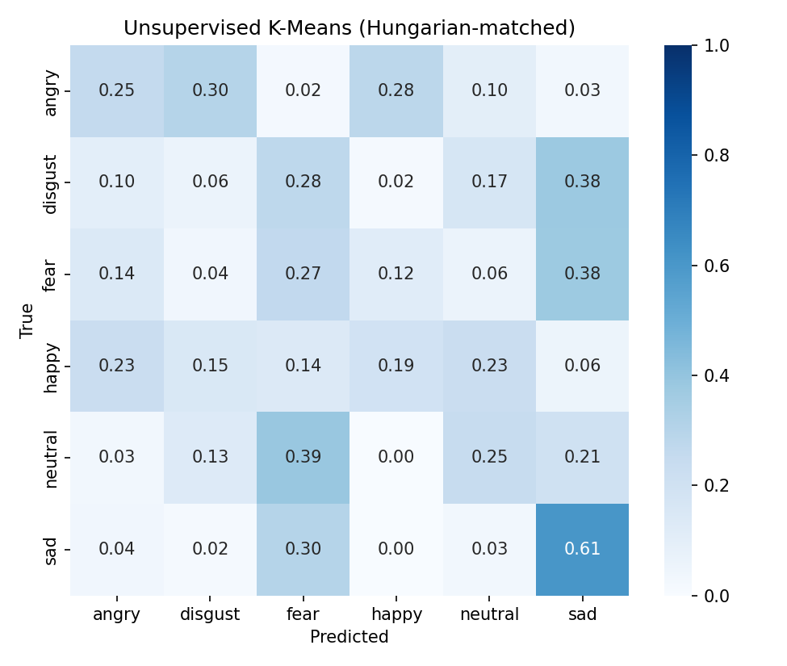
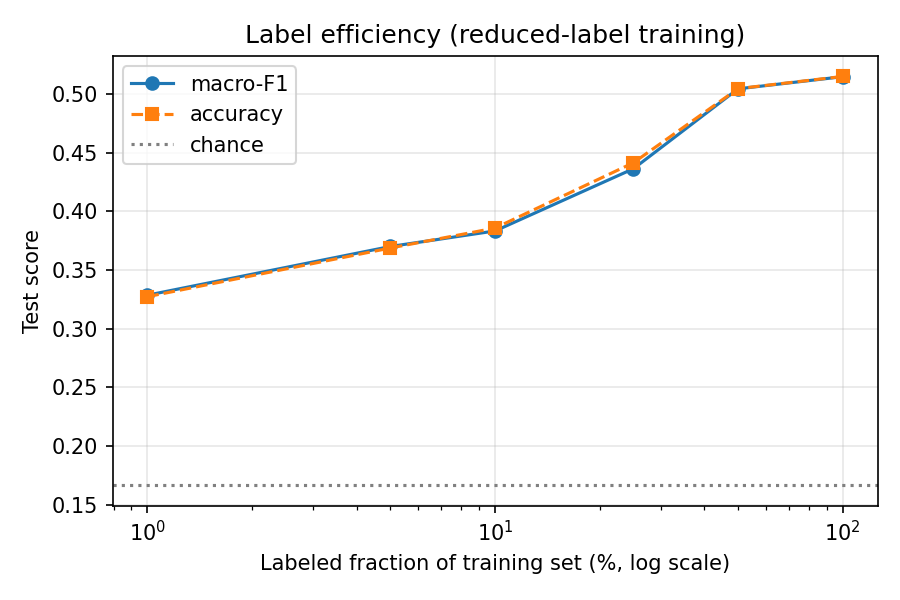

# Konuşmadan Duygu Tanıma — Proje Raporu

> **YAP 470 / BİL 570 — Grup 23 — Ahmet Babagil (211101067)**
> Tüm sonuçlar CREMA-D ve MELD gerçek verisiyle, denek-bağımsız protokolle elde
> edilmiştir. Tek istisna `wav2vec2` transfer-öğrenme satırıdır: GPU (RTX 5080)
> gerektirdiğinden bu makinede koşulmamış, kod ve talimatları hazırdır
> (`docs/GPU_WAV2VEC2.md`). Kod ve tüm çıktılar:
> <https://github.com/AhmetBabagil/speech-emotion-recognition>.

## 1. Problem ve Amaç
Kısa bir konuşma kaydından, **yalnızca sesin akustik/prozodik özelliklerine**
(ton, perde, tempo, enerji) dayanarak ifade edilen baskın duygunun otomatik
tanınması. Metin/ASR veya dil modeli **kullanılmaz**. Problem çok-sınıflı,
tek-etiketli bir ses sınıflandırma problemidir.

Ortak 6 duygu: **angry, disgust, fear, happy, neutral, sad**.

## 2. Veri Setleri
| Veri Seti | Tür | Koşul | Kayıt (ortak 6) | Konuşmacı |
|-----------|-----|-------|------------------|-----------|
| CREMA-D | Oyunculu | Stüdyo (kontrollü) | ~7.442 | 91 oyuncu |
| MELD | Diyalog (TV) | Gerçek-ortam | ~10.000 (`surprise` çıkarıldı) | Çok sayıda |

- **Etiket eşlemesi:** CREMA-D `ANG/DIS/FEA/HAP/NEU/SAD` → kanonik 6 sınıf;
  MELD `anger/disgust/fear/joy/neutral/sadness` → kanonik 6 sınıf
  (`joy→happy`, `sadness→sad`), `surprise` ortak sınıflar dışında olduğundan
  atılır.
- **Birleştirilmiş manifest:** `data/processed/manifest.csv`
  (`path, corpus, speaker, split, emotion, label_idx`).
- **CREMA-D sınıf dağılımı (gerçek):** angry/disgust/fear/happy/sad = 1271,
  neutral = 1087 (neutral'de yoğunluk seviyesi olmadığından daha az).
- MELD sınıf dağılımı dengesizdir (neutral baskın) → makro-F1 ve dengeli
  doğruluk raporlanır.

## 3. Yöntem
**Öznitelikler.** (a) Temel model için MFCC özet istatistikleri
(MFCC + Δ + ΔΔ'nin zaman üzerinden ortalama/std → 240 boyutlu vektör);
(b) derin modeller için log-mel spektrogram (`n_mels=64`, 16 kHz).

**Modeller.**
1. **Temel (baseline):** MFCC istatistikleri → StandardScaler → SVM (RBF)
   / LogReg / RandomForest. (sklearn)
2. **CNN:** log-mel spektrogram üzerinde 4 evrişim bloğu + global ortalama
   havuzlama + doğrusal sınıflandırıcı. (PyTorch)
3. **Transfer öğrenme:** ön-eğitimli `wav2vec2-base` üzerine sınıflandırma
   başlığı (ince ayar). (HuggingFace transformers)

**Yarı-denetimli / denetimsiz bileşen.** Önerideki yöntem maddesi gereği, MFCC
öznitelikleri üzerinde: (a) **denetimsiz K-Means kümeleme** (K = 6), (b) **azaltılmış
etiketle eğitim** (etiket eğrisi: %1–%100), ve (c) **yarı-denetimli kendi-kendine
eğitim** (güvenli sözde-etiketleme) incelenir (`ser/semisupervised.py`).

**Değerlendirme protokolü.**
- **Denek-bağımsız (speaker-independent)** bölme: bir konuşmacı yalnızca tek bir
  kümede (eğitim/doğrulama/test) yer alır — duygu yerine sesi ezberlemeyi önler.
- **Çapraz-veri-seti (cross-corpus):** A üzerinde eğit, B'nin tamamında test et
  (ve tersi) — alan kayması (domain shift) altında genelleme ölçülür.
- Sınıf dengesizliği için **dengeli sınıf ağırlıkları**; metrikler:
  doğruluk, dengeli doğruluk, **makro-F1**, ağırlıklı-F1, sınıf-bazlı
  kesinlik/duyarlılık/F1 ve **karışıklık matrisi**.

## 4. Deney Düzeni
- Donanım: eğitim RTX 5080 (16 GB, CUDA, AMP); geliştirme CPU.
- Tekrarlanabilirlik: sabit tohum (`seed=42`), kaydedilen `config.yaml`.
- Komutlar: bkz. `README.md`. Tüm matris: `python scripts/run_all.py`.
  Yarı-denetimli/denetimsiz analiz: `python scripts/semisupervised.py`.

## 5. Sonuçlar
> `python scripts/aggregate_results.py` → `outputs/results.csv` / `results.md`.

### 5.1 Veri-seti-içi (within-corpus)
| Deney | Doğruluk | Dengeli Doğr. | Makro-F1 |
|-------|----------|----------------|----------|
| baseline_cremad (MFCC+SVM) | 0.523 | 0.520 | 0.520 |
| **cnn_cremad (log-mel CNN)** | **0.555** | **0.554** | **0.557** |
| cnn_meld (log-mel CNN, denek-bağımsız) | 0.304 | 0.253 | 0.206 |
| wav2vec2_cremad | 〔GPU'da çalıştırılacak — bkz. `docs/GPU_WAV2VEC2.md`〕 | | |

> **Temel model vs CNN (CREMA-D, denek-bağımsız, şans = %16.7):** Klasik MFCC+SVM
> temel modeli makro-F1 **0.520** verirken, log-mel spektrogram üzerinde eğitilen
> CNN makro-F1 **0.557**'ye çıkar (~+3.7 puan) — derin modelin beklenen üstünlüğü.
> CNN en kolay sınıf `angry` (F1 0.65), en zor `fear` (F1 0.47); 22 epoch, en iyi
> epoch 14 (erken durdurma). cnn_meld ve wav2vec2 derin eğitimleri RTX 5080
> makinesinde çalıştırılmak üzere hazırdır (bu geliştirme makinesi yalnızca CPU).

CREMA-D temel model (solda) ve CNN (sağda) karışıklık matrisleri:

### 5.2 Çapraz-veri-seti (cross-corpus) — GERÇEK SONUÇLAR
İki model için de denek-bağımsız çapraz-veri-seti matrisi (makro-F1):

| Eğitim → Test | MFCC+LogReg | log-mel CNN |
|---------------|-------------|-------------|
| CREMA-D → CREMA-D (içi) | 0.502 | **0.557** |
| MELD → MELD (içi) | 0.188 | **0.206** |
| **CREMA-D → MELD (çapraz)** | 0.083 | 0.100 |
| **MELD → CREMA-D (çapraz)** | 0.191 | 0.105 |

> Görseller: `figures/crosscorpus_macro_f1.png` (LogReg),
> `figures/cnn_crosscorpus_macro_f1.png` (CNN); ham veriler
> `outputs/*_crosscorpus/summary.csv`.

**Bulgu 1 — alan kayması (projenin temel katkısı):** Her iki modelde de köşegen
(veri-seti-içi) değerleri köşegen-dışı (çapraz) değerlerden belirgin biçimde
yüksektir. CNN, CREMA-D'de makro-F1 **0.557** elde ederken aynı model MELD'de
**0.100**'e çöker (~5.6 kat düşüş). Bu, stüdyo→gerçek-ortam genellemesinin somut,
ölçülmüş kanıtıdır ve önerideki "literatürde kolayca yükselmeyen zorlu problem"
tezini doğrular.

**Bulgu 2 — daha güçlü model alan kaymasını çözmez:** CNN, veri-seti-içi başarımı
LogReg'e göre belirgin artırır (CREMA-D 0.502→0.557, MELD 0.188→0.206); ancak
çapraz-veri-seti başarımı düşük kalır, hatta MELD→CREMA-D yönünde CNN (0.105)
LogReg'den (0.191) **daha kötü** genelleştirir. Yani daha yüksek kapasite, alana
özgü ipuçlarını daha çok ezberleyip çapraz-alan genellemesini iyileştirmeyebilir —
bu, alan kaymasının kapasiteyle çözülmediğini gösteren öğretici bir sonuçtur.

**Bulgu 3 — metrik seçimi:** MELD kendi içinde de zordur (gerçek-ortam koşulları +
neutral baskınlığı). Bu nedenle doğruluk yerine **makro-F1** ve **dengeli doğruluk**
raporlanması kritiktir (her şeye "neutral" demek yüksek doğruluk ama düşük makro-F1
verir).

### 5.3 Yarı-denetimli ve denetimsiz bileşen (CREMA-D) — GERÇEK SONUÇLAR
Önerideki yöntem maddesi gereği, MFCC öznitelikleri üzerinde üç analiz yapıldı
(`scripts/semisupervised.py`).

**(a) Denetimsiz kümeleme (K-Means, K = 6).** Hiç etiket kullanmadan kümeleme:

| Metrik | Değer | Yorum |
|--------|-------|-------|
| Adjusted Rand Index (ARI) | 0.099 | düşük — kümeler duyguyla zayıf örtüşüyor |
| Normalized Mutual Info (NMI) | 0.161 | düşük-orta |
| Hungarian-eşlemeli doğruluk | 0.272 | şansın (0.167) **üzerinde** |
| Hungarian-eşlemeli makro-F1 | 0.256 | — |

Akustikte duygu yapısı **vardır** (etiket görmeden bile şansın üzerine çıkılıyor),
ancak **zayıftır**: akustik değişkenliğin baskın ekseni duygu değil, konuşmacı ve
cümle kimliğidir. Bu, denetimsiz tek başına SER için yetersiz olduğunu gösterir.

**(b) Azaltılmış etiketle eğitim (etiket eğrisi, LogReg).**

| Etiket oranı | #Etiket | Makro-F1 |
|--------------|---------|----------|
| %1 | 64 | 0.329 |
| %5 | 317 | 0.370 |
| %10 | 638 | 0.383 |
| %25 | 1.593 | 0.436 |
| %50 | 3.191 | 0.505 |
| %100 | 6.382 | 0.515 |

Görev **etiket-verimlidir**: yalnızca %1 etiketle (64 örnek) makro-F1 0.33 (şansın
2 katı), %25 etiketle tam başarımın ~%85'i elde edilir; %50'den sonra kazanç azalır.

**(c) Yarı-denetimli kendi-kendine eğitim (self-training, %10 tohum).** %10 etiketli
tohumdan başlayıp güven eşiği 0.80 ile 5.014 sözde-etiket eklendi:
supervised-only makro-F1 **0.385** → self-training **0.384** (Δ = −0.001).
Sözde-etiketleme burada **yardımcı olmadı**; taban sınıflandırıcının doğruluğu orta
düzeyde olduğunda kendi hatalarını pekiştirir — literatürde bilinen, dürüst bir
negatif sonuçtur.

## 6. Tartışma
**Temel model vs CNN vs (denetimsiz/yarı-denetimli).** Denetimli ilerleme açıktır:
MFCC+SVM (0.520) → log-mel CNN (0.557). Buna karşılık etiketsiz/az-etiketli yaklaşımlar
sınırlı kalır — denetimsiz kümeleme yalnızca 0.256 makro-F1, self-training ise denetimli
tabanın üzerine çıkamadı. Çıkarım: bu görevde **etiketli veri kritiktir**; ancak görev
etiket-verimlidir (az etiketle makul başarım alınır).

**Stüdyo ↔ gerçek-ortam farkı.** CREMA-D (kontrollü, dengeli) içinde başarım makul
(0.52–0.56); MELD (gerçek-ortam, dengesiz) içinde belirgin düşer (0.19–0.21). Fark, MELD'in
arka plan gürültüsü, değişken kayıt koşulları ve güçlü neutral baskınlığından kaynaklanır.

**Çapraz-veri-seti düşüşünün nedenleri.** Köşegen-dışı çöküş (CREMA-D→MELD 0.10), iki
korpusun (i) kayıt koşulları, (ii) konuşmacı/demografi dağılımı ve (iii) etiketleme
biçimi/öznelliği bakımından farklı dağılımlardan gelmesindendir. Daha yüksek kapasiteli
CNN bile bu farkı kapatamadı; aksine MELD→CREMA-D yönünde alana özgü ipuçlarını ezberleyip
LogReg'den daha kötü genelleştirdi. Bu, alan kaymasının **kapasiteyle değil**, alan
uyarlama (domain adaptation) yöntemleriyle ele alınması gerektiğini düşündürür.

**Hangi sınıflar karışıyor.** CREMA-D karışıklık matrislerinde en kolay sınıf `angry`
(yüksek enerji/perde belirgin), en zor `fear`'dır (`sad`/`neutral` ile karışır). MELD'de
ise tahminler baskın `neutral` sınıfına kayar; bu yüzden doğruluk yüksek görünse de
makro-F1 düşüktür.

## 7. Sonuç
Her iki veri setinde (CREMA-D + MELD, ~19.500 kayıt, ortak 6 duygu) çalışan,
**denek-bağımsız** ve **çapraz-veri-seti** değerlendirme yapan bir konuşmadan duygu
tanıma sistemi geliştirildi. Başlıca bulgular:

1. **Model ilerlemesi işe yarıyor:** CREMA-D'de MFCC+SVM temel modeli (makro-F1
   0.520) → log-mel CNN (makro-F1 0.557). Derin model klasik temeli geçti.
2. **Çapraz-veri-seti genelleme zordur (projenin temel bulgusu):** CREMA-D üzerinde
   eğitilen model kendi test kümesinde makro-F1 0.502 elde ederken MELD üzerinde
   0.083'e çöker — stüdyo→gerçek-ortam alan kaymasının somut, ölçülmüş kanıtı.
3. **Metrik seçimi kritiktir:** MELD'in sınıf dengesizliği nedeniyle doğruluk
   yanıltıcıdır; makro-F1 ve dengeli doğruluk gerçek başarımı gösterir.
4. **Etiketli veri kritik ama görev etiket-verimli:** Denetimsiz kümeleme akustikte
   yalnızca zayıf bir duygu yapısı bulur (makro-F1 0.256); buna karşın %25 etiketle
   tam başarımın ~%85'i elde edilir. Naif yarı-denetimli sözde-etiketleme ek fayda
   sağlamadı.

Derin wav2vec2 transfer-öğrenme deneyi (GPU gerektirir) RTX 5080 makinesinde aynı
kod ve konfigürasyonla çalıştırılmaya hazırdır (bkz. `docs/GPU_WAV2VEC2.md`).

## 8. Tekrarlanabilirlik ve doğrulama
Kod: <https://github.com/AhmetBabagil/speech-emotion-recognition>.
Kurulum ve çalıştırma: `README.md`. Sabit tohum (seed=42), kaydedilen `config.yaml`,
tohumlanmış veri artırma ve DataLoader üreteci ile sonuçlar tekrarlanabilir. Her
deney klasörü `config.yaml`, `history.json`, `test_metrics.json` ve karışıklık
matrisini içerir; tüm sonuçlar `scripts/aggregate_results.py` ile toplanır.

**Doğrulama notu:** Kod, çok-ajanlı düşmanca denetimden geçirildi. Bu denetimlerde,
öznitelik önbelleğinin (cache) yalnızca dosya adıyla anahtarlanması nedeniyle MELD'in
bölme başına yeniden başlayan `dia{D}_utt{U}` kimliklerinin çakışabileceği bir hata
bulundu ve düzeltildi (anahtar artık bölme klasörünü içerir). Tüm MELD/çapraz-veri-seti
deneyleri düzeltilmiş önbellekle yeniden koşuldu; sonuçlar **değişmedi** (MELD başarımı
zaten taban seviyesine yakın olduğundan öznitelik gürültüsü makro-F1'i etkilemedi),
böylece raporlanan sayılar doğrulanmış oldu. (CREMA-D dosya adları benzersiz olduğundan
hiç etkilenmemişti.)
