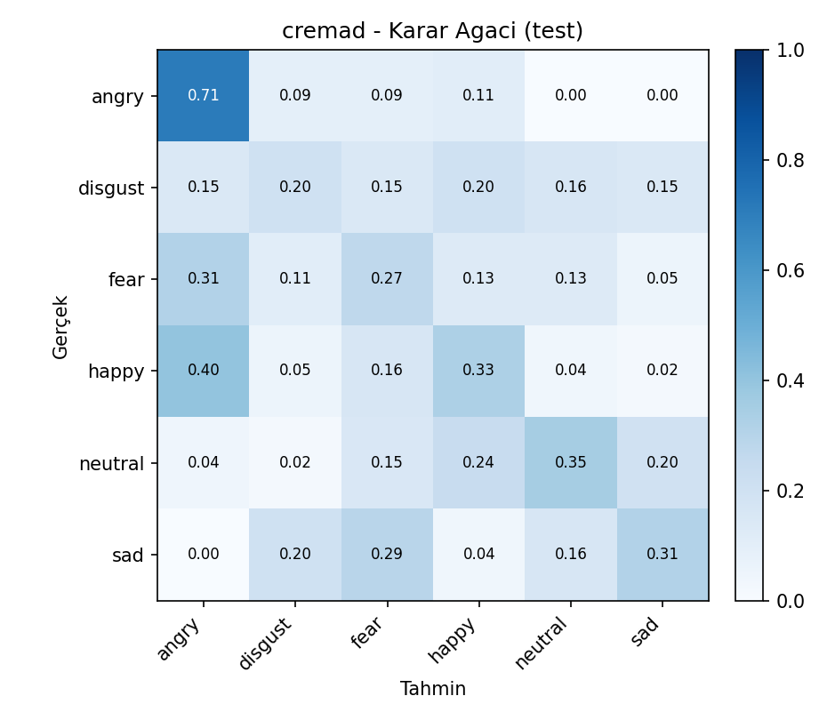
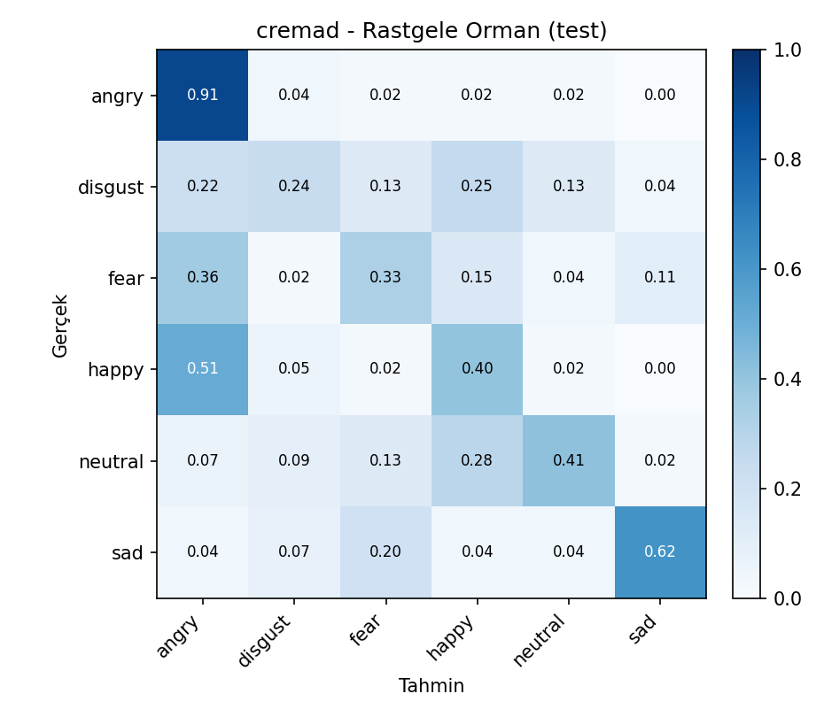
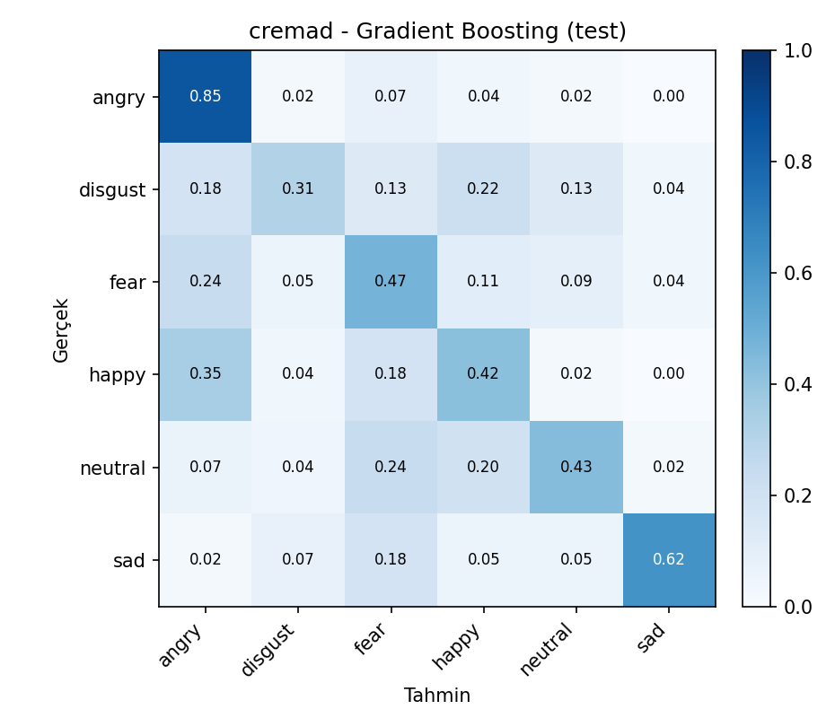
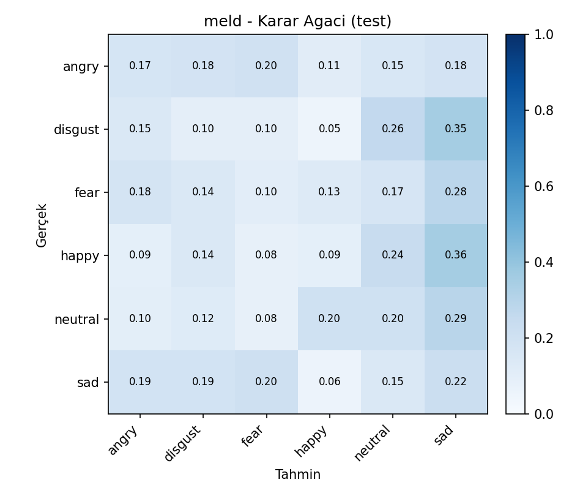
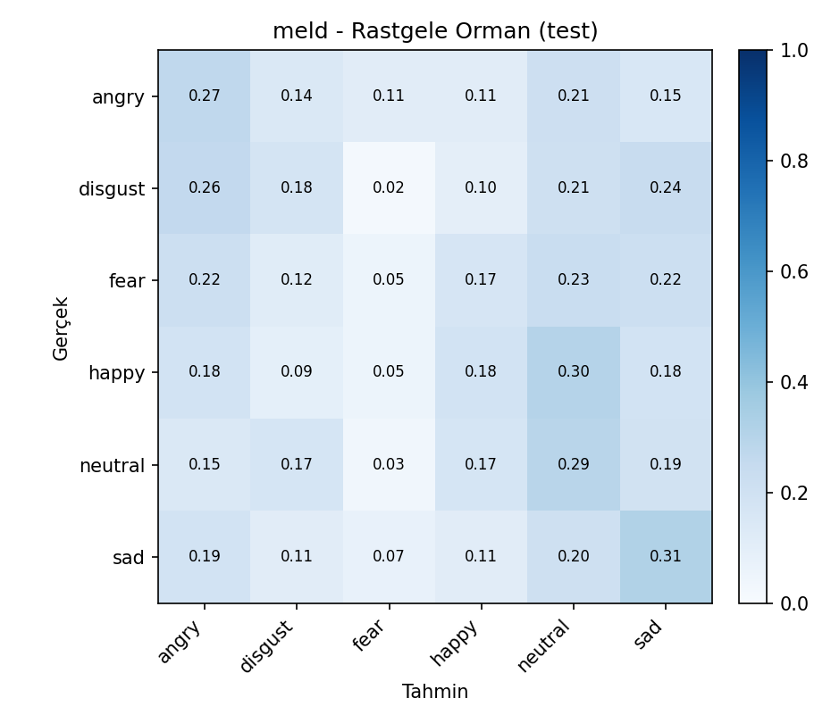
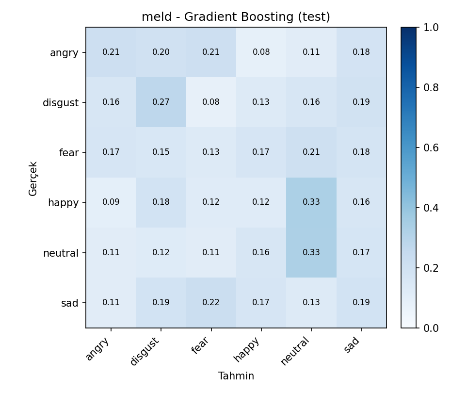

# YAP 470 / BIL 570 - Proje Ilerleme Raporu 2

Tablo ve basliklar ders sablonuna gore doldurulmustur.

## Erisim Bilgileri


**Ogrenci:** Ahmet Babagil - 211101067

**Orijinal Veri Seti Adi:** CREMA-D ve MELD

**Orijinal Veri Seti Baglantisi:**

- CREMA-D: https://github.com/CheyneyComputerScience/CREMA-D
- CREMA-D ses aynasi: https://huggingface.co/datasets/AbstractTTS/CREMA-D
- MELD: https://github.com/declare-lab/MELD
- MELD raw veri: http://web.eecs.umich.edu/~mihalcea/downloads/MELD.Raw.tar.gz

**Proje Calismasinin Yuklendigi Google Drive Baglantisi:**

- https://drive.google.com/drive/folders/1Hbp4WtCGFZjpvQCDxFmqtOmeqq-SMPvW?usp=sharing

**Kod / GitHub Deposu:**

- https://github.com/AhmetBabagil/speech-emotion-recognition/tree/feat/speech-emotion-recognition

Ilk asamada kullanilan veri setleri degistirilmedi. Drive teslim klasorune proje dosyalariyla birlikte `veri_seti_ses.zip` veri seti arsivi de konuldu; ayrica orijinal veri seti baglantilari ve indirme/manifest olusturma kodlari yukarida verildi. Proje kodu, deney ciktilari, rapor dosyalari, validation gridleri, test sonuclari ve karmasiklik matrisleri `odev2` klasorunde hazirlandi.

**Calistirilacak Dosyalar ve Ne Yaptiklari:**

| Dosya | Gorev |
|---|---|
| `odev1/extract.py` | Ses dosyalarindan donmus Wav2Vec2 ozniteliklerini cikarir ve cache'e kaydeder. Bu adim pahali oldugu icin 1. asamadaki cache tekrar kullanildi. |
| `odev2/run_experiment.py` | CREMA-D ve MELD icin Decision Tree, Random Forest ve Gradient Boosting validasyon gridlerini calistirir; en iyi modeli train+validation ile yeniden egitip test setinde olcer. |
| `odev2/model_pipeline.py` | Veri bolme, StandardScaler, PCA, model kurma, class weight/sample weight, validation secimi, test metrikleri ve karmasiklik matrisi uretimini icerir. |
| `odev2/build_report.py` | Deney ciktilarindan rapor tablolari, test karsilastirmalari ve otomatik bulgulari uretir. |
| `odev2/SONUCLAR.ipynb` | Test karsilastirmalarini, validation kapsamini ve karmasiklik matrislerini Jupyter formatinda gosterir. |

Calistirma komutlari:

```bash
python odev2/run_experiment.py --manifest odev1/manifest_subset.csv --grid-mode report
python odev2/build_report.py
```

## Veri Seti ve Degerlendirme Metrikleri

Projede konusmadan duygu tanima problemi ele alindi. Iki veri seti kullanildi:

| Veri seti | Kisa aciklama | Ortak siniflar |
|---|---|---|
| CREMA-D | Kontrollu/studyo ortaminda kaydedilmis oyuncu konusmalari | angry, disgust, fear, happy, neutral, sad |
| MELD | TV diyaloglarindan gelen daha dogal ve gurultulu konusmalar | angry, disgust, fear, happy, neutral, sad |

MELD veri setindeki `surprise` sinifi CREMA-D ile ortak olmadigi icin cikarildi. Iki veri seti de ayni 6 duygu sinifi uzerinde degerlendirildi.

Egitim, gecerleme ve test bolmeleri konusmaci bagimsiz yapildi. Ayni konusmaci train, validation ve test bolumlerinde birlikte bulunmadi. Bu tercih, modelin ayni konusmacinin ses ozelliklerini ezberlemesini engellemek icin kullanildi.

Degerlendirme metrikleri:

- Accuracy
- Balanced accuracy
- Macro-F1
- Weighted-F1
- Sinif bazli precision/recall/F1
- Karmasiklik matrisi

Ana model secim metrigi validation macro-F1 olarak belirlendi. Veri setlerinde sinif dagilimi ve siniflarin zorluklari farkli oldugu icin accuracy tek basina yeterli gorulmedi; macro-F1 ve balanced accuracy ozellikle raporlandi.

## Yontem

Ses kayitlari once Wav2Vec2 tabanli donmus oznitelik cikarici ile vektorlere donusturuldu. Bu asamada Wav2Vec2 modeli egitilmedi; yalnizca her ses girdisi icin sabit uzunluklu oznitelik vektoru elde edildi.

Oznitelik vektoru icin uc farkli havuzlama/boyut secenegi hiperparametre olarak denendi:

| F | Anlami |
|---|---|
| 768 | Wav2Vec2 zaman ekseni mean havuzlama |
| 1536 | mean + std havuzlama |
| 2304 | mean + std + max havuzlama |

PCA oncesinde StandardScaler uygulandi. StandardScaler ve PCA yalnizca egitim verisine fit edildi; validation ve test setlerine sadece transform uygulandi. Bu sekilde validation/test bilgisi egitim asamasina sizdirilmadi.

PCA boyutu da hiperparametre olarak ele alindi. Decision Tree ve Random Forest icin `none`, `64`, `128`, `256`; Gradient Boosting icin calisma suresi nedeniyle `none` ve `64` secenekleri denendi. PCA uygulanmayan durumda model dogrudan normalize edilmis Wav2Vec2 vektorleri uzerinde egitildi.

Sinif dengesizligi icin Decision Tree ve Random Forest modellerinde `class_weight="balanced"` kullanildi. Gradient Boosting modelinde ayni amacla `sample_weight` kullanildi.

## Model Gecerleme

F: Oznitelik vektoru boyutu

P: PCA cikti vektoru boyutu (`none` PCA uygulanmadigini gosterir)

X: Modelin ana hiperparametresi 1

Y: Modelin ana hiperparametresi 2

Z: Modelin ana hiperparametresi 3; Gradient Boosting icin iki ana hiperparametre oldugundan Z yoktur.

Model bazinda X/Y/Z karsiliklari:

| Model | X | Y | Z |
|---|---|---|---|
| Decision Tree | criterion | max_depth | min_samples_split |
| Random Forest | n_estimators | max_depth | max_features |
| Gradient Boosting | learning_rate | max_depth | - |

Hiperparametre secimi test setine bakmadan yapildi. Her veri seti ve model icin validation grid calistirildi. En iyi kombinasyon once validation macro-F1'a gore, esitlik durumunda balanced accuracy ve accuracy degerlerine gore secildi. Secilen kombinasyon daha sonra train + validation verisi uzerinde yeniden egitildi ve test seti yalnizca final degerlendirme icin kullanildi.

Deney kapsami:

| Veri seti | Model | Denenen kombinasyon sayisi |
|---|---|---|
| CREMA-D | Decision Tree | 216 |
| CREMA-D | Random Forest | 72 |
| CREMA-D | Gradient Boosting | 24 |
| MELD | Decision Tree | 216 |
| MELD | Random Forest | 72 |
| MELD | Gradient Boosting | 24 |

Asagidaki tablolar, her veri seti-model ikilisi icin validation macro-F1'a gore en iyi kombinasyonlari gostermektedir. Tam grid dosyalari `odev2/outputs/<veri_seti>/*_validation_grid.csv` altinda saklandi.
## CREMA-D - Karar Agaci validasyon

| Sira | F | PCA | Hiperparametreler | Val dogr. | Val dengeli dogr. | Val makro-F1 |
|---|---|---|---|---|---|---|
| 1 | 1536 | none | criterion=entropy, max_depth=8, min_samples_split=10 | 0.4049 | 0.4056 | 0.4031 |
| 2 | 1536 | none | criterion=log_loss, max_depth=8, min_samples_split=10 | 0.4049 | 0.4056 | 0.4031 |
| 3 | 1536 | none | criterion=entropy, max_depth=16, min_samples_split=2 | 0.3902 | 0.3881 | 0.3859 |
| 4 | 1536 | none | criterion=log_loss, max_depth=16, min_samples_split=2 | 0.3902 | 0.3881 | 0.3859 |
| 5 | 1536 | none | criterion=entropy, max_depth=8, min_samples_split=2 | 0.3902 | 0.3917 | 0.3851 |
| 6 | 1536 | none | criterion=log_loss, max_depth=8, min_samples_split=2 | 0.3902 | 0.3917 | 0.3851 |
| 7 | 1536 | none | criterion=entropy, max_depth=None, min_samples_split=10 | 0.3829 | 0.3806 | 0.3804 |
| 8 | 1536 | none | criterion=entropy, max_depth=16, min_samples_split=10 | 0.3829 | 0.3806 | 0.3804 |
| 9 | 1536 | none | criterion=log_loss, max_depth=None, min_samples_split=10 | 0.3829 | 0.3806 | 0.3804 |
| 10 | 1536 | none | criterion=log_loss, max_depth=16, min_samples_split=10 | 0.3829 | 0.3806 | 0.3804 |
| 11 | 2304 | none | criterion=entropy, max_depth=8, min_samples_split=10 | 0.3829 | 0.3849 | 0.378 |
| 12 | 2304 | none | criterion=log_loss, max_depth=8, min_samples_split=10 | 0.3829 | 0.3849 | 0.378 |

## CREMA-D - Gradient Boosting validasyon

| Sira | F | PCA | Hiperparametreler | Val dogr. | Val dengeli dogr. | Val makro-F1 |
|---|---|---|---|---|---|---|
| 1 | 1536 | none | learning_rate=0.1, max_depth=3 | 0.5244 | 0.5226 | 0.5238 |
| 2 | 1536 | none | learning_rate=0.05, max_depth=3 | 0.522 | 0.5206 | 0.5151 |
| 3 | 768 | none | learning_rate=0.1, max_depth=3 | 0.5073 | 0.5052 | 0.5043 |
| 4 | 2304 | none | learning_rate=0.1, max_depth=3 | 0.5098 | 0.5056 | 0.5016 |
| 5 | 768 | none | learning_rate=0.05, max_depth=3 | 0.5024 | 0.5016 | 0.4966 |
| 6 | 2304 | none | learning_rate=0.05, max_depth=3 | 0.5024 | 0.5008 | 0.4949 |
| 7 | 2304 | none | learning_rate=0.1, max_depth=1 | 0.4976 | 0.496 | 0.4858 |
| 8 | 1536 | none | learning_rate=0.1, max_depth=1 | 0.4927 | 0.4913 | 0.4808 |
| 9 | 768 | none | learning_rate=0.1, max_depth=1 | 0.4854 | 0.4825 | 0.478 |
| 10 | 768 | 64 | learning_rate=0.05, max_depth=3 | 0.478 | 0.4786 | 0.4683 |
| 11 | 768 | 64 | learning_rate=0.1, max_depth=3 | 0.4756 | 0.475 | 0.4664 |
| 12 | 2304 | 64 | learning_rate=0.1, max_depth=3 | 0.4732 | 0.475 | 0.4629 |

## CREMA-D - Rastgele Orman validasyon

| Sira | F | PCA | Hiperparametreler | Val dogr. | Val dengeli dogr. | Val makro-F1 |
|---|---|---|---|---|---|---|
| 1 | 1536 | none | max_depth=16, max_features=log2, n_estimators=100 | 0.5049 | 0.5048 | 0.4964 |
| 2 | 2304 | none | max_depth=24, max_features=sqrt, n_estimators=100 | 0.5049 | 0.5028 | 0.4941 |
| 3 | 768 | none | max_depth=None, max_features=log2, n_estimators=100 | 0.5 | 0.4984 | 0.4924 |
| 4 | 768 | none | max_depth=24, max_features=log2, n_estimators=100 | 0.5 | 0.498 | 0.4923 |
| 5 | 2304 | none | max_depth=None, max_features=sqrt, n_estimators=100 | 0.5024 | 0.5004 | 0.4904 |
| 6 | 2304 | 128 | max_depth=16, max_features=log2, n_estimators=100 | 0.5 | 0.5004 | 0.487 |
| 7 | 1536 | none | max_depth=24, max_features=log2, n_estimators=100 | 0.5 | 0.4972 | 0.4863 |
| 8 | 1536 | none | max_depth=None, max_features=log2, n_estimators=100 | 0.5 | 0.4976 | 0.4859 |
| 9 | 768 | none | max_depth=16, max_features=log2, n_estimators=100 | 0.4951 | 0.494 | 0.4841 |
| 10 | 2304 | 64 | max_depth=24, max_features=log2, n_estimators=100 | 0.4927 | 0.4909 | 0.4821 |
| 11 | 2304 | none | max_depth=16, max_features=log2, n_estimators=100 | 0.4927 | 0.4909 | 0.4807 |
| 12 | 1536 | none | max_depth=None, max_features=sqrt, n_estimators=100 | 0.4927 | 0.4913 | 0.4804 |

## MELD - Karar Agaci validasyon

| Sira | F | PCA | Hiperparametreler | Val dogr. | Val dengeli dogr. | Val makro-F1 |
|---|---|---|---|---|---|---|
| 1 | 768 | 128 | criterion=gini, max_depth=8, min_samples_split=10 | 0.2512 | 0.2579 | 0.2492 |
| 2 | 768 | 128 | criterion=gini, max_depth=8, min_samples_split=2 | 0.2488 | 0.2549 | 0.2461 |
| 3 | 768 | 64 | criterion=gini, max_depth=None, min_samples_split=2 | 0.2365 | 0.2313 | 0.2299 |
| 4 | 768 | 64 | criterion=gini, max_depth=8, min_samples_split=2 | 0.2291 | 0.2349 | 0.2285 |
| 5 | 768 | 64 | criterion=gini, max_depth=8, min_samples_split=10 | 0.2291 | 0.2348 | 0.2283 |
| 6 | 768 | 64 | criterion=entropy, max_depth=16, min_samples_split=2 | 0.2266 | 0.2221 | 0.2223 |
| 7 | 768 | 64 | criterion=log_loss, max_depth=16, min_samples_split=2 | 0.2266 | 0.2221 | 0.2223 |
| 8 | 768 | 64 | criterion=gini, max_depth=16, min_samples_split=2 | 0.2266 | 0.2218 | 0.2203 |
| 9 | 768 | 64 | criterion=entropy, max_depth=None, min_samples_split=10 | 0.2266 | 0.2177 | 0.217 |
| 10 | 768 | 64 | criterion=entropy, max_depth=16, min_samples_split=10 | 0.2266 | 0.2177 | 0.217 |
| 11 | 768 | 64 | criterion=log_loss, max_depth=None, min_samples_split=10 | 0.2266 | 0.2177 | 0.217 |
| 12 | 768 | 64 | criterion=log_loss, max_depth=16, min_samples_split=10 | 0.2266 | 0.2177 | 0.217 |

## MELD - Gradient Boosting validasyon

| Sira | F | PCA | Hiperparametreler | Val dogr. | Val dengeli dogr. | Val makro-F1 |
|---|---|---|---|---|---|---|
| 1 | 1536 | 64 | learning_rate=0.1, max_depth=3 | 0.2365 | 0.2312 | 0.2268 |
| 2 | 2304 | none | learning_rate=0.05, max_depth=3 | 0.234 | 0.2251 | 0.2234 |
| 3 | 768 | none | learning_rate=0.1, max_depth=3 | 0.2291 | 0.2193 | 0.2204 |
| 4 | 1536 | none | learning_rate=0.1, max_depth=3 | 0.2241 | 0.2172 | 0.2185 |
| 5 | 768 | 64 | learning_rate=0.1, max_depth=1 | 0.2365 | 0.2232 | 0.215 |
| 6 | 1536 | 64 | learning_rate=0.05, max_depth=3 | 0.2192 | 0.2172 | 0.2138 |
| 7 | 768 | 64 | learning_rate=0.05, max_depth=3 | 0.2241 | 0.2157 | 0.212 |
| 8 | 2304 | none | learning_rate=0.1, max_depth=1 | 0.2291 | 0.2216 | 0.2112 |
| 9 | 1536 | none | learning_rate=0.05, max_depth=3 | 0.234 | 0.2157 | 0.2082 |
| 10 | 2304 | 64 | learning_rate=0.1, max_depth=1 | 0.2241 | 0.2135 | 0.2046 |
| 11 | 2304 | 64 | learning_rate=0.05, max_depth=3 | 0.2143 | 0.2061 | 0.202 |
| 12 | 768 | 64 | learning_rate=0.05, max_depth=1 | 0.2241 | 0.2109 | 0.201 |

## MELD - Rastgele Orman validasyon

| Sira | F | PCA | Hiperparametreler | Val dogr. | Val dengeli dogr. | Val makro-F1 |
|---|---|---|---|---|---|---|
| 1 | 2304 | 64 | max_depth=16, max_features=sqrt, n_estimators=100 | 0.2586 | 0.2379 | 0.2349 |
| 2 | 768 | 128 | max_depth=None, max_features=log2, n_estimators=100 | 0.2389 | 0.2323 | 0.234 |
| 3 | 1536 | 64 | max_depth=None, max_features=log2, n_estimators=100 | 0.2537 | 0.2355 | 0.2333 |
| 4 | 768 | 64 | max_depth=24, max_features=sqrt, n_estimators=100 | 0.2537 | 0.2342 | 0.2295 |
| 5 | 2304 | 256 | max_depth=None, max_features=log2, n_estimators=100 | 0.2414 | 0.2277 | 0.2274 |
| 6 | 2304 | 128 | max_depth=None, max_features=sqrt, n_estimators=100 | 0.2611 | 0.2341 | 0.2246 |
| 7 | 1536 | 128 | max_depth=24, max_features=sqrt, n_estimators=100 | 0.2365 | 0.2211 | 0.2228 |
| 8 | 1536 | 128 | max_depth=None, max_features=sqrt, n_estimators=100 | 0.2488 | 0.2264 | 0.2224 |
| 9 | 2304 | 128 | max_depth=16, max_features=log2, n_estimators=100 | 0.2389 | 0.2213 | 0.2202 |
| 10 | 1536 | 64 | max_depth=16, max_features=sqrt, n_estimators=100 | 0.234 | 0.2213 | 0.2198 |
| 11 | 768 | 128 | max_depth=None, max_features=sqrt, n_estimators=100 | 0.234 | 0.22 | 0.2186 |
| 12 | 1536 | 128 | max_depth=16, max_features=log2, n_estimators=100 | 0.234 | 0.2187 | 0.2185 |

## 2. asama modelleri test karsilastirmasi

| Veri seti | Model | F | PCA | Hiperparametreler | Test dogr. | Test dengeli dogr. | Test makro-F1 | Test agirlikli-F1 |
|---|---|---|---|---|---|---|---|---|
| CREMA-D | Gradient Boosting | 1536 | none | learning_rate=0.1, max_depth=3 | 0.5202 | 0.5179 | 0.5144 | 0.5153 |
| CREMA-D | Rastgele Orman | 1536 | none | max_depth=16, max_features=log2, n_estimators=100 | 0.486 | 0.484 | 0.4721 | 0.4717 |
| CREMA-D | Karar Agaci | 1536 | none | criterion=entropy, max_depth=8, min_samples_split=10 | 0.3614 | 0.361 | 0.3496 | 0.3494 |
| MELD | Gradient Boosting | 1536 | 64 | learning_rate=0.1, max_depth=3 | 0.2093 | 0.2072 | 0.2027 | 0.2068 |
| MELD | Rastgele Orman | 2304 | 64 | max_depth=16, max_features=sqrt, n_estimators=100 | 0.2116 | 0.2146 | 0.2006 | 0.2004 |
| MELD | Karar Agaci | 768 | 128 | criterion=gini, max_depth=8, min_samples_split=10 | 0.1465 | 0.1475 | 0.143 | 0.1463 |

## KNN dahil genel test karsilastirmasi

| Veri seti | Model | F | PCA | Hiperparametreler | Test dogr. | Test dengeli dogr. | Test makro-F1 | Test agirlikli-F1 |
|---|---|---|---|---|---|---|---|---|
| CREMA-D | Gradient Boosting | 1536 | none | learning_rate=0.1, max_depth=3 | 0.5202 | 0.5179 | 0.5144 | 0.5153 |
| CREMA-D | Rastgele Orman | 1536 | none | max_depth=16, max_features=log2, n_estimators=100 | 0.486 | 0.484 | 0.4721 | 0.4717 |
| CREMA-D | KNN (Odev 1) | 2304 | 256 | K=15 | 0.4798 | 0.4803 | 0.4657 | 0.4641 |
| CREMA-D | Karar Agaci | 1536 | none | criterion=entropy, max_depth=8, min_samples_split=10 | 0.3614 | 0.361 | 0.3496 | 0.3494 |
| MELD | Gradient Boosting | 1536 | 64 | learning_rate=0.1, max_depth=3 | 0.2093 | 0.2072 | 0.2027 | 0.2068 |
| MELD | Rastgele Orman | 2304 | 64 | max_depth=16, max_features=sqrt, n_estimators=100 | 0.2116 | 0.2146 | 0.2006 | 0.2004 |
| MELD | KNN (Odev 1) | 768 | 128 | K=5 | 0.2047 | 0.2063 | 0.1941 | 0.1938 |
| MELD | Karar Agaci | 768 | 128 | criterion=gini, max_depth=8, min_samples_split=10 | 0.1465 | 0.1475 | 0.143 | 0.1463 |

## Otomatik bulgular

- CREMA-D icin en iyi model Gradient Boosting (test makro-F1=0.5144).
- MELD icin en iyi model Gradient Boosting (test makro-F1=0.2027).
- Genel en iyi sonuc CREMA-D veri setinde Gradient Boosting ile elde edildi (test makro-F1=0.5144).
## Deney Sonuclari ve Degerlendirme

Test sonuclari incelendiginde CREMA-D veri setinde en iyi performans Gradient Boosting ile elde edildi. Bu model test macro-F1 = 0.5144 degerine ulasti. Random Forest ikinci sirada kalirken, tek Decision Tree modeli daha dusuk performans verdi. Bu sonuc, tek agac modelinin yuksek boyutlu ses ozniteliklerinde yeterince genelleyemedigini; ensemble tabanli yontemlerin daha kararli oldugunu gostermektedir.

MELD veri setinde genel performans CREMA-D'ye gore belirgin sekilde dusuktur. Bunun temel nedeni MELD'in TV diyaloglarindan gelmesi, kayit kosullarinin daha dogal/gurultulu olmasi ve duygu siniflarinin daha zor ayrilmasidir. MELD uzerinde de en yuksek test macro-F1 degeri Gradient Boosting ile elde edildi: 0.2027. Random Forest cok yakin bir sonuc verdi; KNN ise bu iki modele yakin fakat biraz daha dusuk kaldi.

KNN dahil genel karsilastirmada CREMA-D icin Gradient Boosting, 1. asamadaki KNN sonucunu gecti. MELD icin de Gradient Boosting en yuksek macro-F1'i verdi. Bu nedenle genel en iyi model Gradient Boosting olarak degerlendirildi. Ancak MELD sonuclarinin dusuk olmasi, sonraki asamada daha guclu oznitelik cikarimi, veri artirma veya veri seti ozelinde daha uygun modeller denenmesi gerektigini gostermektedir.

Karmasiklik matrisleri asagida ve `odev2/outputs/<veri_seti>/*_confusion_matrix.png` dosyalarinda verildi. CREMA-D matrislerinde siniflarin MELD'e gore daha iyi ayrildigi gorulmektedir. MELD'de siniflar arasi karisma daha yuksektir; bu da macro-F1 degerinin dusuk kalmasina neden olmustur.

### CREMA-D Karmasiklik Matrisleri

Decision Tree:



Random Forest:



Gradient Boosting:



### MELD Karmasiklik Matrisleri

Decision Tree:



Random Forest:



Gradient Boosting:



## Sonuc ve Ileride Yapilacaklar

Bu asamada iki veri seti icin uc farkli makine ogrenimi modeli gelistirildi ve karsilastirildi: Decision Tree, Random Forest ve Gradient Boosting. Her model icin oznitelik boyutu, PCA boyutu ve model hiperparametreleri validation seti uzerinde sistematik olarak arandi. Test seti yalnizca final degerlendirme icin kullanildi.

Sonuclar, ensemble tabanli modellerin tek karar agacina gore daha basarili oldugunu gosterdi. CREMA-D uzerinde en iyi sonuc Gradient Boosting ile elde edildi. MELD veri setinde performans daha dusuk kaldi; bu durum veri setinin dogal/gurultulu yapisindan ve duygu siniflarinin daha zor ayrilmasindan kaynaklanmaktadir.

Sonraki asamada yapilabilecekler:

- MELD icin daha guclu veya veri setine daha uygun oznitelik cikarimi denemek.
- Wav2Vec2 vektorleri disinda farkli ses temsilleriyle karsilastirma yapmak.
- Sinif bazli hata analizini karmasiklik matrisleri uzerinden detaylandirmak.
- Daha genis hiperparametre aramasi veya daha verimli arama stratejileri denemek.
- CREMA-D ve MELD arasindaki domain farkini azaltacak yontemler uzerinde calismak.
